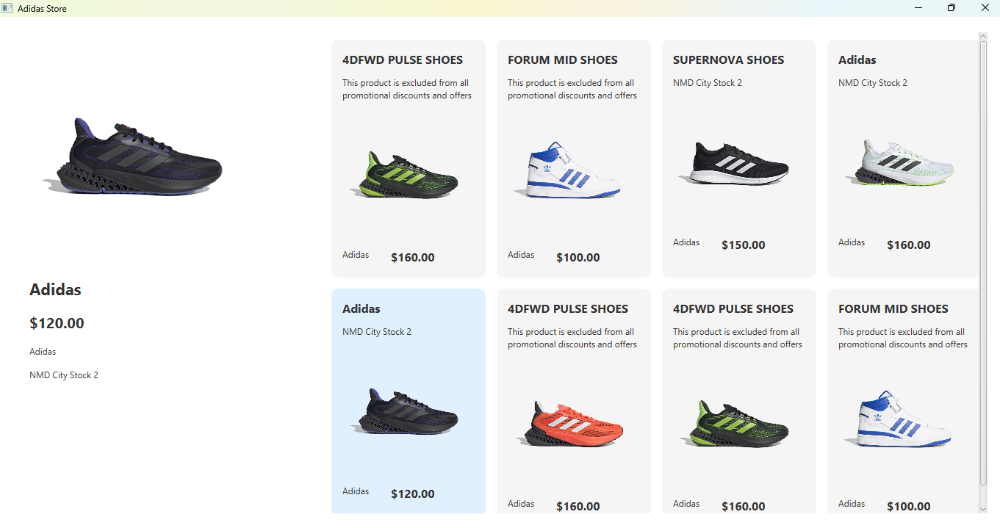

# Adidas Shoe Store - JavaFX App

Màn hình JavaFX mô phỏng cửa hàng giày Adidas, cho phép người dùng xem chi tiết sản phẩm và hình ảnh sản phẩm.

## 🎯 Tính năng
- Hiển thị danh sách giày dạng lưới.
- Click vào sản phẩm để xem chi tiết bên trái.
- Hiệu ứng thay đổi sản phẩm đã chọn.

## 🖼️ Giao diện minh họa

## 🚀 Cách chạy
1. Mở project bằng IntelliJ IDEA hoặc bất kỳ IDE nào hỗ trợ JavaFX.
2. Đảm bảo cấu hình JDK và JavaFX đúng.
3. Chạy class `AdidasStore.java`.

## 📁 Cấu trúc dự án

